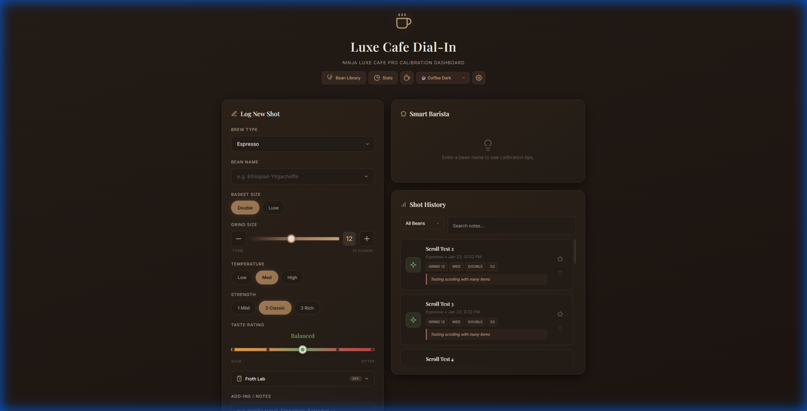
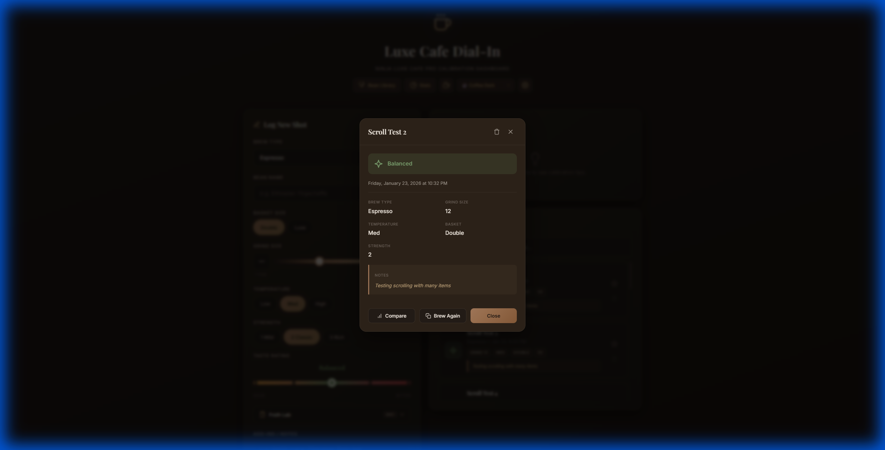
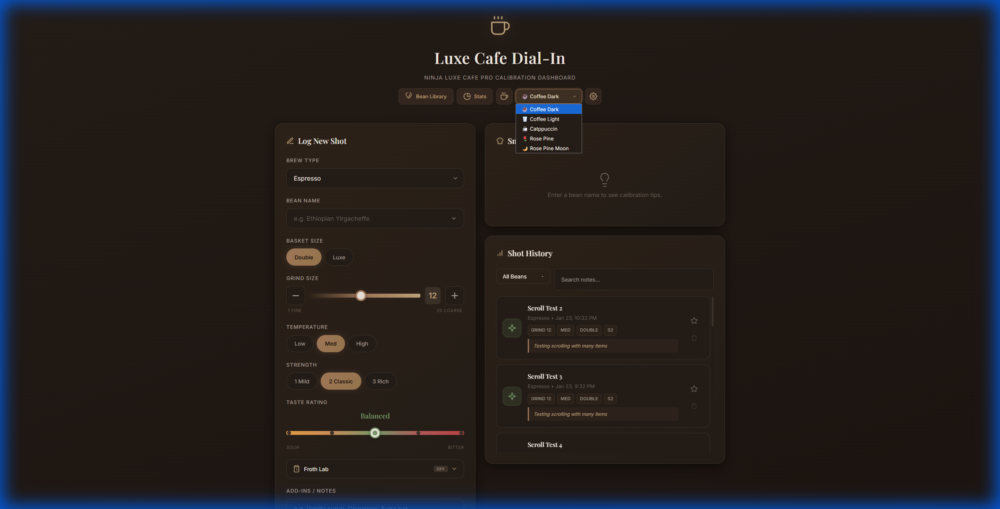
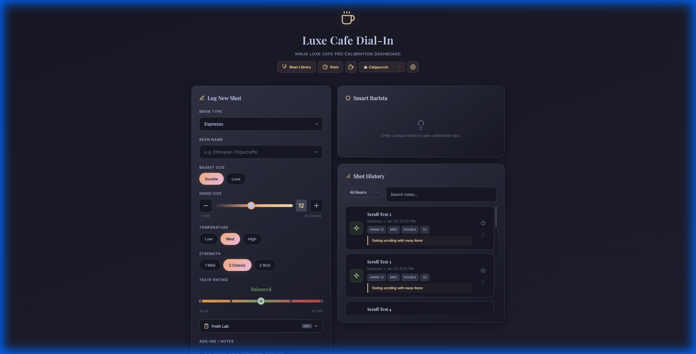
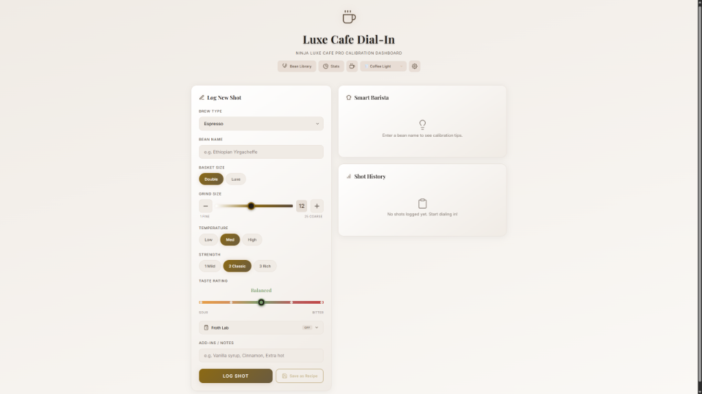
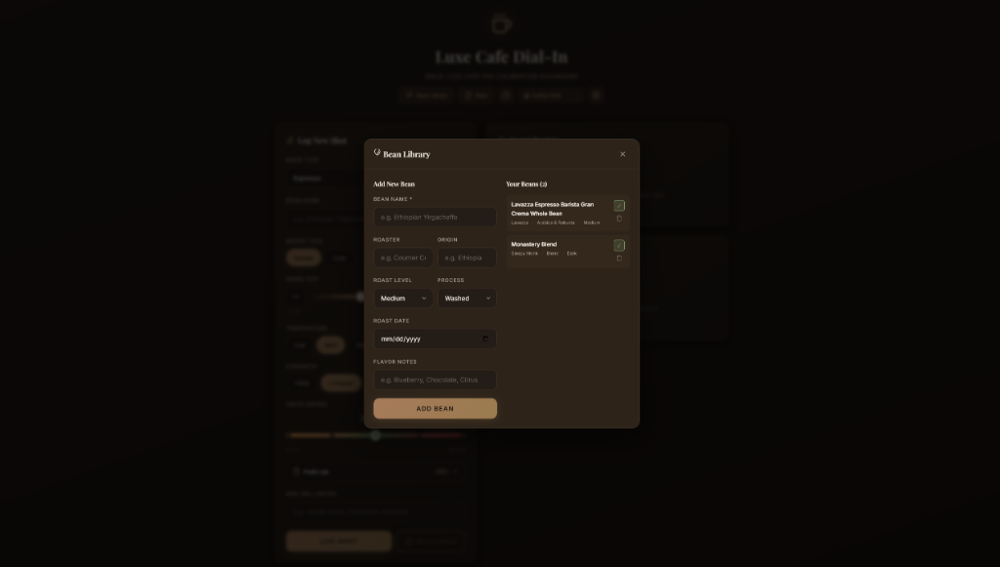
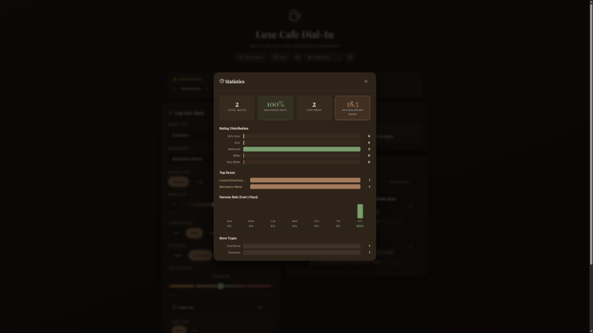

# ☕ Luxe Cafe Dial-In

**Espresso Calibration Dashboard for the Ninja Luxe Cafe Pro**

A premium React-based dashboard for tracking and perfecting your espresso shots. Log your brews, get smart calibration tips, save favorite recipes, and dial in the perfect cup every time.

  



---

## ✨ Features

### 📝 Shot Logging
- **Bean Name Autocomplete** — Quickly select from previously used beans
- **Brew Type Selector** — Espresso, Drip Coffee, Cold Brew, Cold Pressed, Over Ice
- **Hardware-Accurate Controls** — Grind size 1-25, Basket (Single/Double/Luxe), Temperature, Strength
- **5-Point Taste Rating** — Discrete slider from Very Sour → Balanced → Very Bitter

### 🔍 Shot Details & Actions
Click any shot in history to view full details with actionable buttons:
- **Compare** — Compare current shot against your target recipe
- **Brew Again** — Instantly reload all settings to log another shot
- **Delete** — Remove shots with one-click trash icon



---

### 🎨 5 Beautiful Themes
Switch between 5 carefully crafted color themes using the dropdown in the header or press **Ctrl+D** to cycle:

| Theme | Description |
|-------|-------------|
| ☕ **Coffee Dark** | Original warm espresso tones |
| 🥛 **Coffee Light** | Bright cream/latte aesthetic |
| 🍵 **Catppuccin Mocha** | Pastel accents on navy-purple |
| 🌹 **Rose Pine** | Muted elegant rose tones |
| 🌙 **Rose Pine Moon** | Darker Rose Pine variant |

<p align="center">
  
  
</p>
<p align="center">
  
</p>

---

### 📚 Bean Library
Manage your coffee bean collection with detailed metadata:
- **Bean Name & Roaster** — Track origin and supplier
- **Roast Level** — Light, Medium, Medium-Dark, Dark
- **Process Method** — Washed, Natural, Honey, Anaerobic
- **Roast Date** — Track freshness
- **Flavor Notes** — Record tasting notes (e.g., "Blueberry, Chocolate, Citrus")



---

### 📊 Statistics Dashboard
View your brewing analytics with the Stats modal:
- **Total Shots Logged** — Track your espresso journey
- **Favorite Beans** — See which beans you use most
- **Taste Distribution** — Histogram of your taste ratings
- **Average Grind Size** — Track your grind tendencies



---

### 🥛 Froth Lab
Collapsible milk settings panel:
- **Milk Type** — Dairy or Plant-based
- **Style** — Steamed, Thin, Thick, Cold Foam

### 📋 Add-ins & Notes
- Record extras like "Vanilla syrup, Cinnamon, Extra hot"
- Notes display on history cards for easy reference

### ⭐ Pin Best Shot
- Star any shot as your "Target Recipe" for that bean
- Favorites get a gold border and sort to the top
- Target Recipe box shows ideal settings when selecting a bean

### ⚡ Quick Recipes
- Save complete drink configurations with one click
- Recipe chips at dashboard top for instant form auto-fill
- Saves: Bean, Brew Type, Grind, Temp, Basket, Strength, Milk, Notes

### 🤖 Smart Barista
- Real-time calibration tips based on your last shot
- Actionable advice: "Grind finer" / "Lower temperature"
- Visual adjustment badges (Major/Minor)

### 💾 Data Management
- **Export Data** — Download all shots, beans, and recipes as JSON
- **Import Data** — Restore data from a backup file
- **Clear All Data** — Start fresh with confirmation protection

### 📱 Mobile-Optimized
- 44px+ touch targets for all interactive elements
- Thick sliders easy to grab on touchscreens
- Responsive layout for phones and tablets

---

## ⌨️ Keyboard Shortcuts

| Shortcut | Action |
|----------|--------|
| **Ctrl+D** | Cycle through themes |

---

## 🚀 Quick Start

```bash
# Install dependencies
npm install

# Start development server
npm run dev

# Build for production
npm run build
```

Open [http://localhost:5173](http://localhost:5173) in your browser.

---

## 🛠️ Tech Stack

| Technology | Purpose |
|------------|---------|
| **React 18** | UI Components |
| **TypeScript** | Type Safety |
| **Vite** | Build Tool & Dev Server |
| **Vanilla CSS** | Custom Theme System |
| **localStorage** | Data Persistence |

---

## 📁 Project Structure

```
espresso_dashboard/
├── src/
│   ├── App.tsx          # Main dashboard component
│   ├── types.ts         # TypeScript interfaces
│   ├── utils.ts         # Storage & helper functions
│   ├── index.css        # Complete design system with themes
│   └── main.tsx         # React entry point
├── docs/
│   └── screenshots/     # README screenshots
├── index.html
├── package.json
├── tsconfig.json
└── vite.config.ts
```

---

## 🎨 Design System

5 themes with CSS custom properties for easy customization:

**Coffee Dark (Default)**
- Background: `#1a1512` → Cards: `#2a221d`
- Text: `#f5f0e8` (cream) + `#a67b5b` (caramel accents)

**Coffee Light**
- Background: `#f5f0e8` → Cards: `#ffffff`
- Text: `#2a221d` (espresso brown)

**Catppuccin Mocha**
- Background: `#1e1e2e` → Cards: `#313244`
- Pastel accents: mauve, peach, pink

**Rose Pine** / **Rose Pine Moon**
- Muted elegant palette with rose and gold highlights

Typography: **Playfair Display** (headings) + **Inter** (body)

---

## 💾 Data Storage

All data persists in `localStorage`:

| Key | Contents |
|-----|----------|
| `espresso-shots` | Shot history with timestamps |
| `espresso-favorites` | Bean → Shot ID mapping |
| `espresso-recipes` | Saved quick recipes |
| `espresso-beans` | Bean library with metadata |
| `espresso-theme` | Selected theme preference |

---

## 📄 License

MIT © 2026
